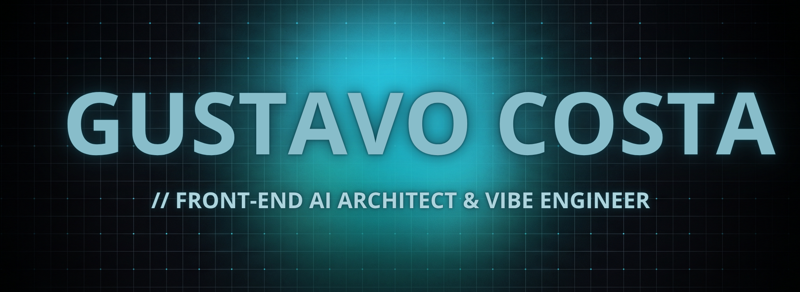

<div align="center">
  


<br>

<p align="center">
  Engenharia de interfaces <b>ultra-fluidas</b> e integrações lógicas avançadas. Transformo complexidade algorítmica em experiências de utilizador imersivas, utilizando ferramentas de vanguarda e design orientado a dados.
</p>

<p align="center">
  <a href="mailto:gustavosoares0428@gmail.com"></a>
  <a href="https://www.linkedin.com/in/gustavo-costa-3a1862339/"></a>
  <br>
  <code>[LOC_NODE]: Ljubljana // SI</code>
</p>

</div>

<br>

### ⚙️ `[SYSTEM_CAPABILITIES]`

Orquestração de interfaces e automação de fluxos assistidos por Inteligência Artificial (10x Productivity).

<div align="left">
  
  
  
  
  
  
  
  
  
  
  
</div>

<br>

### 📊 `[ENGINEERING_METRICS]`

Em vez de métricas de vaidade, o meu foco está na eficiência do código em produção. Abaixo estão os alvos arquiteturais que persigo e garanto em cada projeto:

| Métrica Core Web Vital | Meu Target | Status em Produção |
| :--- | :--- | :--- |
| **LCP** (Largest Contentful Paint) | `< 0.8s` | ✅ Otimizado via Lazy-loading |
| **FID** (First Input Delay) | `< 50ms` | ✅ Main-thread livre de bloqueios |
| **CLS** (Cumulative Layout Shift) | `0.0` | ✅ Dimensões estáticas e Aspect-ratio isolado |
| **Speed Index** (Mobile) | `95+` | ✅ Validado no Google PageSpeed Insights |

---
<br>

### 🛠️ `[DEVELOPMENT_WORKFLOW]`

Como um **AI Architect**, utilizo a inteligência artificial não apenas para escrever código mais rápido, mas para garantir padrões rigorosos de arquitetura:

```javascript
const workflow = {
  ideation: "Prompt Engineering focado em design patterns e Clean Code",
  engineering: "Cursor AI focado em refatoração molecular e componentização",
  optimization: "Análise obsessiva via Lighthouse para mitigação de Layout Thrashing",
  deployment: "CI/CD automatizado via GitHub Actions com deploy na Vercel"
};
```
<br>

<div align="center">
  <picture>
    <source media="(prefers-color-scheme: dark)" srcset="https://raw.githubusercontent.com/Gus96costa/Gus96costa/output/github-snake-dark.svg" />
    
  </picture>
</div>


